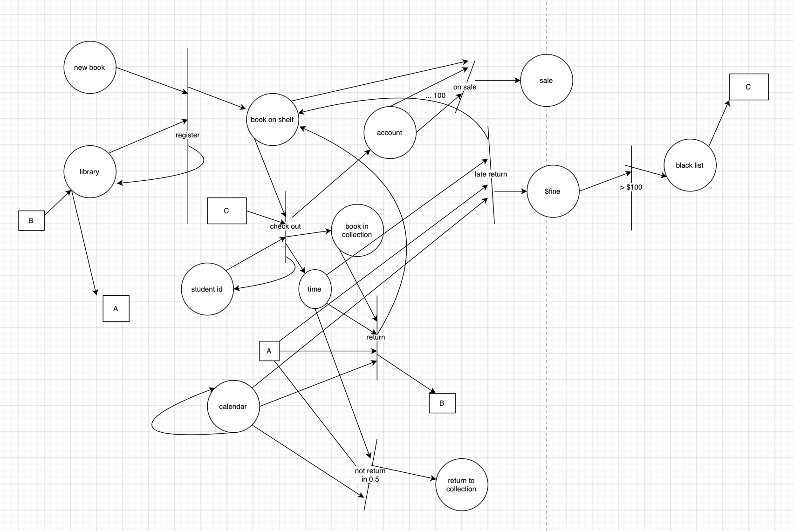
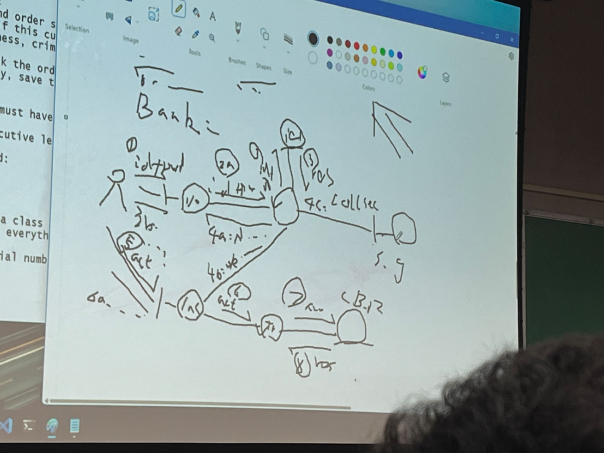
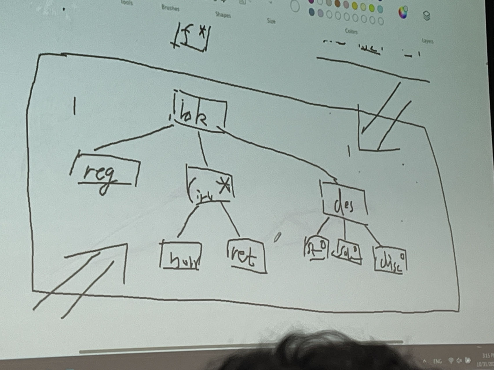
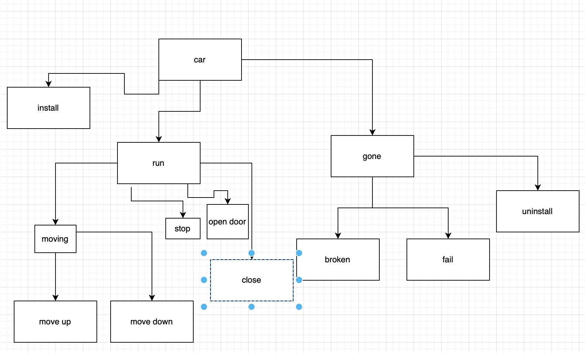

## What is computer science:

Problem solving, using computer in the most efficient way(with the lowest complexity)

<pan style = "green"> hello </pan>

${\color{red}hello }$

Complexity: time (reduce duration cost for cpu/gpu)\
Space(big data aera, cancer center: 1 saan 2G+) O(n)\
Kolmogorov: founder of axiomic probability theory/chaitin\
k-complexity

reduce Size/length of the alg (algorithm)
dry: don’t repeat yourself

Efficiency: achieve good time + space complexity\

1 concept: important In cs/se
2.alg design/code
3.math/stat/probability analysis\

language: matlab  
good in python: similar as matlab\

low Kolmogorov
understandability: for peer programmers to know your idea form your code(your src code)

how to achieve it: clean logic , variable/function name meaningful, add comments (every function have a paragraph, every 10 lines, add a sentence help other or self to understand)

mac:
OS X: variant of unix
More beautiful
User-friendly: to customer (not coders) easy and fun to use  
Don’t be proud of making system ugly (like unix ..)

A/B testing: abused by IT/ google  
Has 2 version, randomly choose IP/customer, see which version is more popular
Ask paid tester to do:#limit

Big data: size of data to be processed is huge, O(n) space
chatGPT: 500GB RAM

big company: n customers ( n is huge) indexed from 0 to n-1 which means range (n)
free food to every customer, no double dipping all allowed, no one double dipping
suppose only 1 customer didn’t pick up free food yet
how to find out who the customer is ?
efficient design:
LUT: remember the index get ride of LUT
N entries
1 number to single out the missing index/person/customer
Afterwards, sort the LUT  
Space complexity: O(n) not viable  
Reduce space from O(n) to sublinear, O(1)

Math to solve this:
Sum total of those who already came
Sum from 1 to n: n\*(n+1)/2 = F_sum
F_sum – sum: will be the one (index) never shows up

What if 2 customers didn’t come?
F-sum –sum =I +j
100: sum of the 2 index
2 unknows, 2 equations to uniquely resolve I ,j  
i+j=F-sum-sum (1)
i**2+j**2= fixed diff value
…
i**k+j**k = fixed value’

stream data proc/big proc

OS: chunk swapping : garbage collection
Allocate space

Request a new (huge) array to save 1-5, 45123 to the original location  
O(n) space: sub linear to n
Using algorithm to simulate circular linked list

Trade time for space

Program = data structure + algorithm

Binary search: log(n): almost linear, hashing table: O(1) search  
Space for hashing O(n)

9/5
chunk swapping: array as ds, alg to emulate the linked list ds: data structure  
simple ds , smart alg
1 2 3 4 5 -> 4 5 1 2 3 1 2 3 4 5 -> 3 4 5 1 2  
k: 1 to n-1
k\*n: time

k<n/2: shift to the left
k>n/2: shift to the right

n-k: <n/2
min(k, n-k): improved the efficiency  
solve problem: with lowest complexity

Text Boxchunk swapping: array , use loops to emulate circular linked list

program(solve) = data structure + algorithm
solve #1: smart alg, simple ds  
solve #2: smart ds, simple alg

efficiency: time + space complexity
trade-off: both low on time and low on space(big breakthru)
high on both: bad programming

better
linked list:
change Head, Tail, break one link to original head
time complexity is much better than alg .1

choose the ds wisely, alg is so simple
alg 2 better than alg.1

software engineering: motivation

system based on computer: code + fix (software develops)
write the code, deliver system, if trouble surfaces, fix it
DoD US: fund $$, projects

Contractor lifeline is DoD

Software crisis: let drop all software projects (…)
Expensive ($1M, $3M, $5M) ->$15M
Unreliable: today works, tomorrow not working, fix
Hard to maintain

Software engineering: apply successful engineering principles to software develop

Default: agile model: variant of water-fall model where the system in cut into small pieces

How to build a bridge?

(similar to water-fall model). (first and dominant for years, not popular any more)
Meetings: feasibility studies, field study, secure $
Form a blueprint (design): by engineer, more meetings to evaluation design
Send construction engineers to build
Testing phase: last a while
Deliver & walk/drive
Maintenance  
Retire/blow up
Software: copy cat of this engineer principle

Life cycle models: the series of steps to develop a huge software system.

Difference between software system and ord/ conventional engineering projects:
Have many visual tools to help communications between clients/customer and developer
Visualization (can’t see /touch directly)
Moving targets: 100m, 400m … marathon  
Clients/bosses feel entitled to ask for changes lack of mutual understanding

Say absolutely no: allow some meeting, justify why not

Use many diagrams: finite state machine (FSM), petri-nets, e-r diagram, class diagrams

Have diagrams and equations

Natural language: ambiguities

9/7/2030

life cycle model: agile model: many meetings daily/weekly
how frequency stand up, sprints

M. Hamilton/2016, got solve real world problem using lowest complexity
Time/length/space
Text Box
Own library: cheating (chatGPT: collect by others’ work)

CASE: computer aided software engineering
Any tools that can help improve the software engineering process

Case: can help us in coding it useful and powerful (google/Facebook has own case Tensorflow: google brain release for free 2nd most popularly used DL/ML pack  
Facebook/meta: pytorch torch 1st popular esp in academia
Try new idea

Git: case to collaborate , version control ,regret, change back

Make: use case.
Huge system: selective compiling
Makefile: dependencies tree, compile those changed ones,

Editor: CASE tool,
Notepad? X
Python: vs code :
PyCharm (out of box, space hungry)
Sublime: used to be popular
Vim/meovim:config . vimrc as good as vs code

Local: gui based editor
Vim/neovim: server side coding

Vi: original unix editor, git
shell script: automate

windows: batch .bat (ugly by ms) PowerShell: big deal object based shell programming

general ones

CS/CE: more popular Just coder

Life cycle: coding is small part of life as se

Math modeling: good in math, calculus (Deep Neural network: DNN CNN: convolutional NN) biology

Taylor series, chain rule: f(g(x)) : f’\*g’
Gradient descent to change parameters of the NN

Aircraft: nothing to do with bird

Google: most $$ svd: eigen vector
Singular vector decomposition
Matrix, eigen analysis links,
M=USV^T (svd)
Probability: math derivative/statistics: inductive evidence

Log(n) and n**0.0001  
Alg 1 : log(x)
Alg 2: x**0.0001

Limit x->+oo log(x)/x**d = 0
Log(x) is cheaper than x**d, when x ->oo

Log(x)’ =1/x
X**d’=x**(d-1)

Sympy ( solve math problem )

Skip list: data structure in big data

Express line of subway:
CCNY -> time square
Smart way to go:

First set a objective function: take the least possible stops

# of stops

best/smartest plan should be with least number of stops

average # of stops all nyers will make ; grand average n stations

n/2: math assumption, roughly true

introduce express line: reduce avg # of stops nyers will make optimal # of express stops:
find optimal x which can minimize objective function(# of avg stops nyers  
1 too few, N is too many

In US military: military: engineering, not (art)
Engineering is the key to the success of us

von Neumann: father of CS , mergesort
decimal #: 10 states
binary:
computer can beat human chess champ in 10 years

9/12/2023
express line of subway: foundation for skip list
NYC: ccny ce: blueprint of subway of nyc: classified, national

Construct an express line: $$

Justify the extra $$ to build//dev/maintain
NYers: pay $$

Text BoxFeasibility study: justify/model

Local only: avg nyers N/2 # of stops you have to make  
Obj: as few stops as possible

Add express, prove avg stops avg nyer: no favor or disfavor to anyone

Too many: no reduction of average stops
Too few: favor small group of people unfair

> 1 <N, X :unknown , try to find the math behind to optimize # of stops by choose the right x

find optimal X( # of express stations)
assume we added express line with x stops;
avg # of stops nyers will make:
have some simplification
calculus: continuous, 1st smooth, f’(x) should exist
assume curve/surface having 1st serivative

single (direction) linked list
avg # of exp stops avg nyers will make? X/2
avg # of local stops avg (reasonable) nyers will make? X/N/2

objective: total # of stops avg nyers will make;
f(x) = x+N/x

N is known, x is unknown, find x s.t. f(x) is minimized

X= arg_min_x f(x)=argmin_x(x+N/x), N is a constant

f’(x) = (x + N/x)’ = 1-N/x\*\*2 =0
x = sqrt(N)
if 100 local stops: exp : 10

O(N) -> O(sqrt(N)) sublinear, pay$$
Fun to consider: doubline link list;

Construct reasonable objectives
Make math simplification to facilitate analysis, function to be opt
Optimize: numerically solve: torch/tensorflow: black box/machine
To find parameters to opt objective
Statistics: CS
P(people walk thou the wall) = 0.0000000000000000001
CS -> Boolean logic
math modeling:
a group of people, each person has a annual income x
what is the typical annual income of this group?
Best statistic to represent the annual income of this groups

Avg/mean value: typical annual income (?) one alternative
Median value: sort array, take the middle, odd: even: average of the middle 2

Which is better?
Mean value: not robust, over-sensitive to p/n outliers
Classic stats, result from Normal (Gaussian) distribution

Justify why mean is bad and median is more robust
Setting up an objective
Y I’s, i=1….n
Find a stat A, such that overall error will be minimized

Gauss:
F(x) (total error of using x to represent Yi’s)
(Yi –x )\*\*2
f(x)=
∑𝑛𝑘=0(𝑌𝑖−𝑥)2

mean value minimize the mean square error (MSE)

however median is better, math is uglier

CLT: central limit throrem
Data not that large, not that unrelated

Measured value = real value + Gaussian(GLT)

Robust stats: order stats are more robust
Median , quantile

Median: outliers’ contributions will be discarded

If n is small: enumerate
If n is not small: need statistic

ML,DL: different objective

Form the objective (reasonable);

9/14
mean is the stat minimizes the MSE, so sensitive to outlier ()**2
Gauss: math is elegant
Median is more robust from gauss’s diary
Non-E geometry,
FFT: fast Fourier transform (transform)
1965: FT: O(n**2)
Tukey and ??: robust stats: merge sort like alg, O(nlogn) mp3,jpeg,mpg: based FFT
Median: more robust, small # of outliers won’t affect the median 100k, 100bil

Mse f(x) = \sum (x-xi)\*\*2

L1 error (Manhattan):\sum |x-xi|: outlier’s contributed Is not as serious

4-color thm: planar map: use 4 colors to color no adjacent regions share the color

Measure error:
Euclidean distance L_2
Manhattan distance L_1: for reasonable NYers to move from one position to another position

Use cal 1 to find out the x minimizing the sum of L1 errors;
The median value by def will make the sum total to the derivative = 0
Error measure: positive (allow negative: cancel)
A pond, unknown # of fish: ask to estimate # of fish as close as possible
Population to be evaluate is too large to enumerate

Sampling: alive, freely moving, fish, tiger, bear
Method: capture 10 fish/bear/tiger -> put a label/electronic tag to them, put them back ->
Recapture 10 fish/bear/tiger: count # of tagged alive animals

For example: 2 of them are tagged, # of fish this pond: fraction sampling (method used in most stem disciplines) 50

Have the methodology to justify: statistical reasoning  
Educated guess of  
Mobile population: fraction sampling
Static population: huge lawn, how many grasses we have?
Mountain, # of trees we have  
Estimate of (have stats, cannot enumerate)

10 random throwing

test the goodness of a fertilizer (which method is better)
try 2 brands in 2 different years, Yield 1 yield2, whichever is larger will win 2 years are not fair condition: weather, based on lazy/hardworking the farmer no control over the fertilizer

cancel all factors except the fertilizer
revolutionize the way to do science& engineer  
randomization: in agriculture
medicine: double-blind testing is behind the huge program in medicine

testing: to decide the goodness/badness of an approach

cut the field into small plots, toss a coin, head: use A in this plot, tail: use B ensure the farmers have no idea which plot received which fertilizer (famers’ contribution is nil)
farmers: cancel
weather: cancel
company (A/B): no control chance det the app of different b rands

geography: randomly assigned, cancel each other since we have lots of plots
scientific testing method

double –blind testing:  
separate people into 2 groups: one testing (take the new med) one control (take sugar)
randomized no one can control:
volunteer no idea belong to t or c group?
Lie: ask for bribe: behave diff affect result
new med/vaccine: doctor should not decide which person will receive the med
blind to doc/vol: safeguard the fairness of the test

9/19

double-blind:  
a fraction of papers/ proposal evaluation  
remove author’s names after publication
author should not know who will be the evaluator

single-blind:  
put authors/proposers name
who will evaluate your paper/proposal

double-blind: more objective
single-blind: favor famous guys/instance

cs: google search engine ,vs bing vs duckduck go compare three item
: privacy:

why do you choose google?
Google return more related results/ have you objectively evaluation?
Right way: magic word: double blind:
Keyword should be neutral: a long list of words disinterested to all search engine
No know which engine you are using : randomly choose which engine to use
Evaluation person: have no idea of google/bing/duckduckgo

Gold standard to tell apart science and non-science
Testing to falsify claims

Political science: no result
Philosophers: plato better than conf
Science decide: order

Math is not science: a tool/ man made art

Provide hard evidence: scientific way to evaluate search?

Quick sort: choose an anchor, figure out the final position of anchor
How to choose anchor: first element: vulnerable to attacks

Game theory: open to vicious attacks

Randomized algorithm: solve shark

Ccny cs student vs hunter college cs student:
How to eval:
Randomized repeat this process several times

Binary search O(log n)
Hashing O(1): dictionary

What’s trouble of hashing function?
Collision:
If H(k1)=H(k2), there is a trouble

Hash: even(k)=1, 0? Worst all even k will collide;
Optimal hashing function:
Mod prime, reshuffle bits: avoid collisions

Math: best hashing H(k) should be a uniformly distributed as possible
Disinterested monkey randomly throw the balls to different bins

For example:
N bins b1~bN
N balls:
For one bin k (random): to be empty p(bin k is empty): after n random throws of n balls to n bins

Divide & contral:
After the 1st throw, p1(k is empty) = 1 – 1/n
… 2nd thros, p2 ( k is still empty)=(1-1/n)^2
..
n. After nth pn(…)=(1-1/n)^n
lim x->oo (1-1/x)^2 = 1/e = 0.37 (37 per cent rule)
collide always happen
in hashing: increase the number of bins
O(log log n)
O(1)
Small data: hashing
DB: sorting still alive in DB and big data

In CS: ML/DL Bayesian stats
2 types of stats:
classic stats vs Bayesian (subjective) stats: P(X|Y) conditional

can update out belief based on evidence: ML/DL
everything is objective

9.21 Thursday

P(T|E): posterior probability of a theory T given evidence E
P(T): prior probability (belief)
P(E|T): likelihood probability given theory the likelihood of E
P(E): marginal
Text BoxP(T|E): P(T,E)/P(E) = P(T)P(E|T)/P(E)  
Fear for his life to publish this formula

Weatherman: Saturday: 50%; Sunday: 50%
he claim: for sure we will have a wet weekend
P(wet weekend)=0.75

P(wet weekend) = 1 – P(dray weekend)=1-p(no rain on Saturday)*P(no rain on Sunday)=1-0.5*0.5=0.75

P(speeder captured by police) = 0.01 (1 percent)
P(prof thief to be arrested) = 0.01

Today A is not captured, A to be captured tomorrow: 0.01
Independent
P(tomorrow cap|today cap) = P(tomorrow cap)

What is the probability to be captured if A keep speeding/stealing for a whole year.
P(not captured) = 1 – 0.01 =0.99
1-0.99^365=1

law of court: murder: 12 juror: 0.5
0.5^12

on-line recording:

sufficient stats: avg temp so far sumi=1 to n Xi/n
don’t want to save Xi’s one by one in a huge table

why saving all of them (measurement)
avg_o is sum of x1 up to Xn-1
avg_n is sum of x1 up to Xn

relation between avg_o and avg_n

(n-1)*avg_o = x1+x2+…x_n-1
n*avg_n= x1+x2+…x_n

n*avg_n = (n-1)*avg_o +Xn
avg_n=(n-1)avg_0-avg_n) +Xn
new avg = (n-1)\*avg_diff + Xn

Natural language ambiguous: misunderstanding

Software engineering:
Software crisis:
Feasibility study: math /stat modeling, solvable

Turing machine equivalent: O(n**K) polynomial
1.1**n infeasible

NP-hard: enumerate all possible solutions, to verify is polynomial
Non-deterministic polynomial  
To verify generally is easy O(n\*\*k)
Find the candidate/suspect is hard

Equivalent to a certain known NP hard: traveling saleman’s problem (TSP)

50 cities to visit: optimal route once and only once

non-deterministic polynomial
A murder crime: find out who did it

“easy” brute-force:
arrest everyone

install cameras everywhere, police work will be easy

moving target: lack of visualization, clients feel entitled to ask dev to change the space/des/sys .

mutual misunderstanding: clients and developer, both are too confident, there is a mismatch of the true meaning

gas station: replace the handle after you are done.
Replace: put it back

Reduce mm as much as possible: huge danger
Approaches:

1. More communication (more nature language, distribution) induce more ambiguity
2. common language to improve understanding
3. universal language without any possible ambiguity: math/logic  
   equation will nail down the ambiguities
   4.power means: diagram/figure: many diagrams in engineering
   finite state Machine: FSM regular language

update avg: use space efficient method:
n*n_avg = (n-1)o_avg + Xn
n_avg = (1-1/n)o_avg +1/n* Xn
\eta =1/n

if n is small: if is large
if n is large: if is small 1/n almost zero

n_avg = o_avg +(Xn-o_avg)/n
new_parameter = old_parameter + learning \_factor*diff
discount the experience
new_belieff = old_belief +\eta * diff: Bayesian formula
learning_factor:
37%: in hashing function
explore & exploit policy:

causal process:
make a decision on the point
job-interview policy
100 candidates, each one interviewed for 1 day
what is the optimal policy to decide the winner (get job offer)
ensure the best (possible) candidate to be hired

100days, call the winner? Have complete info, no success

if you find the current one is great, make offer, regret later, not optimal: exploit too early

best policy: interview 50%, in the latter half, make offer to anyone who is better than the best in the 1st half

explore +exploit : explore 50%; exploit; 2nd half

37% rule: explore 1/e percent
63% exploit proved this is the best (stat)
leave some time to explore 37%
test/mock interview: 37%

software quality measure:
efficiency: low in space + time
user-friendly: easy to use by non-cs floks
understandability: peers/self read src code easily
how to achieve: pseudo- English ; var/func names are meaningful, add comments
each function ; 10 lines one sentence; new ds
python: bragging right: one-liner: hurt understandability

peer obs version:
no indentation:

programming : 1. Use same language
1st gen programming language: machine code (binary) cpu: punch/carry cards

2nd gen: assembly: language: require by all cs dept
benefit of assembly:
010101 add AX,01 improved the understandability
correspondence between machine code assembly

has its own benefits: relevant; size of assembly very small

3rd gen: structural programming language; math proof:
type of stmt to sovle TME problem
iteration: loop/recursion
conditional: If else
sequence: in C/C++

pascal: wirth: turing Dijkstra
pure 3rd gen Programming language: no goto/jump
IT/CS industry: no one use pascal too pure to be useful
Ugly but useful c:2.5 gen:assembly+pascal

Organize program into procedure: better reusability  
1000 line function: to better reuse or understand

4th generation:
SQL: Database  
Non TM equivalent for Database(pandas/polars)
Declarative PL: killer of cs/programmers
Write what to do, PL take care the “how” part

Req:print out all boys whose gpa is higher than 3.5

```sql
Select name
From std
Where gender == ‘M’ and gpa >3.5;
```

no general programming language:
prolog: too different  
how part is handled by SQL:
meta-data/stats: improve search efficiency

DB: has a bar/threshold: no redundancies

Text Box

Data warehouse: mongoDB:

hotness dictionary:
Obama;
1995: search Obama: small town in japan

In ccny: gpa > 3.5 then gender

Each condition is a filter

Most selective filter will get small # of success

9.28.23

4th gen PL
SQL: declarative: what/how part: meta-data
Object-oriented PL: java, Ada(DoD), C++: 3.5 gen PL /C#:main
Python: muti-paradigm
Torch, init, forward,
Define a class
Most important /killer feature of oo: inheritance: reusability
Live with inheritance: cut & paste
Localized features

There is no correct software system:  
No proof
Test
Our system never proved, testing is incomplete induction
Poticially correct way:
Our software system is good to our best knowledge in good faith—small font; if you find bugs. Let us know, we’ll try our best to fix

System buggy by nature, find bug, fix once and for all
Hard to traverse/track your bugs

1+2+3+… +n =n(1+n)/2
can’t proof by example

prove by math(complete) induction:
n=1
assume n =k is right  
prove n = k+1

prove by contradiction

Euclid: prove the prime numbers are infinite
Assume the # prime numbers is finite
P1(2), P2(3),P3(5), …,Pn(very)
New_number = P1*P2*…P(n+1)

A new prime > “supposedly” largest on prime number
Contradiction!

Beside inheritance: dynamic blinding

3rd : functional programming: lisp
function programming: golang, scala

function is the 1st class object: higher order function
multi-paradigm:

for any function, there is no side effect: most important feature of function programming

for big data: google/meta/amazon: many servers run many function
no loop: use recursion

Program language: be defensive
Communicate with users: be careful for error/ be nice to users  
Communicate with operating system: be careful
Allocate: assume success, == null

Try
Command functional feature
Catch
Print(‘…’) error information

Life cycle models: sequences of actions to be done in system development(general)

Water-fall model (1st, introduced by DoD, copycat of conv engineering)
Investigation <-> planning <->designing <-> implementation; integration <->testing <-> maintenance ->retire/death

Feasibility: deliver/make $$/contribute to the goodness of humanity

Numpy: matlab
Vectorized computing

a=[1,2,3]
a+3;
a=np.arange(3)
a+3

planning: $$: best way to ask/demand $$: personnel: who to work with
hardware/ software ; OS; case tools to use: collaborate: git; gui package to use: flask; torch/tensorflow; hugging face, skorch

design: modularize the system (divide & conquer) data structure, alg/logic
2nd phase report

implementation + integration:
coding + debugging

difference between debugging and test:

debugging is itself testing, still biased , testing : by others or self, could more objective:: subjective

testing group is different from dev group

alpha version: already passed internal testing, ok by testing group

beta version: dynamic concept: free users: paid users(expects, matlab)
init: alph;  
finally: deliverd version

10.3.23
water-fall
testing: alpha/beta version
google: always beta, collect information about users
maintenance : (after deliverly)
matlab
customer service:

change system: bugs/complains
retirement/death:
cunyfirst: cobol-based system: text prompt

specification is constitution: legal doc
readable to both clients/developer

proceed to next phase: need a system quality assurance (SQA) team to sign off

1st life cycle model( by DoD)
pros: 1st method to copycat engineering principles (success story of engineer) complete doc
spec: plan, design, src, test report, maintenance, report
documentation wirter: science, science engineer  
cons: take too long (time), lack of communications between customers/clients and developer

rapid prototyping: improve communication, quickly develop a small system reflecting the gist (major function) very quickly, using (prototyping programming language) such sql, python ; no worry about robustness … other quality can show our understanding

robustness: should not be esay to crash ( defensive programming)

improve communication : between developer

rom- basic
basic based system: 2 coders, one young guy handled the devlop of the feature part  
one old guy handled the simulation ( r. p of IBM os)

fast, major features, not reusable
pros: take shorter, improve communication
cons: more change of moving targets

rapid prototyping: not a run-alone model: waterfall+rapid prototyping

evolutionary model: partition system into different builds (4), perform waterfall over each build, better know each other based on real working system reduce the overall mutual risk

pros: rudece overall risk, mutually; improve communication; can have experience of real ( partial) system
cons: (fatal trouble) hard to integrate, have to have many B&f revision, rewriting

spiral model (DoD, wall street):
WF+RP+complete risk analysis in every phase
Pros: reduce risk significantly
Cons: $$ very expensive, good only for mil/ big finance

Rocket: trick to increase the success rate
For a single rocket: probability to success is 90%

How to inprove the success rate:
shoot 2 rockets: failure rate 0.1 -> success: 1-0.1\*0.1=.99

King of life cycle models:
Agile model: tasked whole system, have standup(casual report daily, weekly), sprint ( weekly,bi-weekly, task report, plan next tasks); (month, quarter) PI-meeting: high level os, more serious demo

Lots of meetings

Pros: lots of communication, make programs, improve\
quality  
Cons: too many meetings /distractions/waste time

Why agile model is most popular?
Authority:Project officer,project managers, they can see which people is good.

Quiz:  
At last 3 models and cons pros\

consept question (4 sub question)
math/stat/prob model (1)
2 efficient alg design question (2): no coding\
pseudo-code to show your ideas

good problem solving skill in efficiency

# 10/12/2023

skip list(circular double link)
regression(LR)
complexity later for midterm

cousin of the 2-sum question: hashing  
when you interview, first choose is: hashing; binary search then dynamic programming, then greedy alg

A[1] < A[N], how to find i s.t A[i]<A[i+1]

possible?\
How to do it, and prove\
Assume such I not exist\
A[1]>=A[2], A[2]>=A[3]…. A[N-1]>=A[N]
A[1]>=A[N] contradiction

```
Binary search:
A[mid]
Compare A[1] vs A[mid]
=: A[mid]<A[n] reduced by half, condition true: proceed to the 2nd half
<: A[1]<A[mid]: half, focus on the first half

> : A[1]>A[mid]: A[mid]<A[n]: 2nd half
```

binary search: safely discard one half, without losing the loop invariant 1st element < last
complexity of alg based on commanding equation

difference equation: discrete value
differential equation ODE ,PDE

for a problem, based on the alg ideas, formulate the commanding eq:
T(n)=1+T(n-1)=1+1+T(n-2)=…=n+T(0) O(n)

T(n)=1+T(n/2)+1+1+T(n/4)=1+1+…T(1)

Merge sort:
T(n)=2T(n/2)+n
=4T(n/4)+n+n=…
2^x=n
x=log2 n
nlogn

fib:
T(n)=T(n-1)=T(n-2)

How to estimate the order of T(n):

a^n =a^(n-1)+a^(n-2)
a^2 =a+1
1.618 >1
1.618\*\*n: infeasible

10.17.2023

mm: math, diagrams\
UML:unified modeling (diagram)\
3 types: 1. Formal: purely math/logic: finite state \
machine (FSM) : few people understand

2.informal: natural language; confusing, ambiguity/redundancy:mm 3. semi-formal: combination of diagram, NL, math, program language: most popular NLU/Processing
NLP: deep learning, attention
Attention based deep nets for NLP/U

compression: entropy(jpg, mpg, mp3)
Shannon’s communication theory: robust communication
reliable channel: 40s 50s
need redundancy

AFRL: 3 room: Newton, Einstein, Shannon

Analyze: view-point based analysis: exhaust all possible perspective

Simplest UML (industry standard): use-case diagram (using in first report)

Rec: system
Lhs: ord user rhs: prev user
Small ovals inside rec for reatures

Id users/feature/rel btw u/f
Dev fsm: to recognize even numbers (pattern recognition machine)
Alphabet: each state exhaust all possible tokens in the alphab
Name each state by the most recent scanned token so far
Simplified :
Binary number with terminator $, recognize those numbers whose remainder over 3 is 1
4%3=2 fail ,6%3 = 0, 7%3=1 fail

name each state by the remainder fo the value the fsm saw so far  
originally 3k+1
shift to the left: (binary) new value after scanning n_t:
2\*N + new_token = 2(3k+2) + new_token = 6k+4+1%3=1

base *(5/3/7 *k+rem) +new_token
3K+2

item 1 :5, 7, or 3 # of states:
item 2: SPC rem: det which state will go to succ/fail
item 3: number system being used: binary: left shift == multiply by 2
octal: left shift == multiply by 8

recognize a certain pattern:
only binary pattern with 010, or 101 then success

binary streams

10.19.23

FSN: remainders over certain number for certain number system
Binary patterns containing 101 or 010: success if present; fail otherwise  
Alphabet: 0,1,$

Need to know the count of certain patterns
FSM: SW officially not a UML
Improved cousin of FSM: state chart /diagram: (class diagram)
Life cycle (may ask again in midterm or final) Quick learner (rust, golang), class diagrams, team player,

State chart: use rectangles (no circles)
1-short
Initial state and base state are generally the same, long bar
Have base state: iterate
Allow overlapping pattern (if)

Vending machine: smacks price 30 cents
Allowable coins: 5, 10, 24, p

Semi-formal: use-case diagram: all perspectives
Formal: state chart: logic

Data: normal forms (NF)
Onion shape: 3NF (codd: 1970: Turing) set theory Is the math foundation of DB, Codd NF

Data structure for college student:
Ssn, name , age, gender, dept, college , department-chair, college-president, original-country, pre

Relational DB (RDB) 1970: King of all DB
View of many DBs: keep all information, achieve space/update low complexity  
Codd/Boyce: for data , id the key attributes

3NF: all non-key attribute must be directly determined by the key attributes

dept_chair is not directly determine by ssn, transitive (2NF)
for any 2 tuples, if they share the same value on LHS, then they must have the same RHS
if a data store allows redundant tuples, not even 1NF

dept_lead_DB:
dept, dept_chair
Space saving
Update: time

College_lead-data-dict
College, college_pre

SSN-> department_chair true
Not directly determine

SSN->dept  
Dept->dept_chair

Different tuple carry valuable information\
Class roster:\
SSN, course_id, grade\
999, 322, A \
888, 322, C \
777, 321, B\
ssn,course-id,year,semester ->grade 3NF\
key: attributes\
ssn,course_id as a key?

ssn cannot be a key\
cid: not key\
grade: not key

3NF: SE , DB, class , data struct

Data bagging/warehouse ,search efficiency

diagram： entity –relation diagram (E/R diagram): class diagram\

E: rectangle; R: diamond ; links: connect E and R based on diff nature\
Plain edge: many\
Arrow: 1 to many\
Arrow: angular: 0 or 1 (missing is fine)\
Rel: favorite friend

Double edge rec: weak entity: local attus are not enough to uniquely id to tuple\
Double edged diamong: support relation

Small triangle: for inheritance\
RDB: success caused by effective index: sort, binary search\
To index, not to introduce new attr for the purpose of\
indexing

DB dev, drucial info about the constraints: g in g out\
Data entry : ? Data integrity

Each students belongs to one and only one department\
Each department has one faculty as chair\
One std can take many classes\
Each class can have many std\
Each department belong to 1 and only one school\
A college have many school

# 10/26/2023

3 philosophers'/bankers' paradox;\
 eat: civilized 2 sticks

limited resources (3 cs), more users (3 bankers)\
 1 cs: no\
 2 or 3 cs: dead lock:

4 sticks: no limited, no dead lock\
 take the good policy, you can proceed

right policy:

```
take turns; time sharing
```

queue: (priority queue) reasonable\
fair way to proceed

eat 1 bites, go back

E/R diagram: semi

super set of FSM: pertri-net: formal method (rigor),hard

```
not part of UML
```

place: circle, noun medeoling the entities\
transition: long bar with I/O legs, verb actions\
number of legs rep the # of needed resources

inside each place, indicate #/count of available res\
dots to rep

numbers of avail tokens in the place >= the number of legs

library:

```
library:
0) new books must be registered before shelving
1) a std can ck out books with st card
2) books returned before/on deadline just put in shelf
3) books returned late but less than half a year will be fined
4) books not returned > 0.5 year, will be reported to collection
5) std fined for >$100 will be suspended
6)books check out > 100 time will be put on sale

```


always have exactly 1 token available\
petri-net taboos:

```
1.both input and output are AND gate ; different input /different output, create a new trans dont share
```

bk return: 3 case/actions/transition, never share\
removing number of tokens from the

adadd number of tokens to the output place per number of output legs

as design, you only assign possible input place with number of tokens

avoid OR gates\
 never connect 2 trasition directly / place

```
1. every std can register up to 6 courses
2. every class can  have at most 30 std
3. after semester starts, any class with < 10 std will be cancelled
4.any std taking < 3  class will be warned
5. any class cancelled > 3 time will be cancel forever
```

# 10/31

## formal method : mid 1 petri-net

FSM/state chart: reg lang, not TM

read only: date flow diagram (DFD) used to be the king of all SE diagram\
able to understand

```
   bubble chart
   legacy diagram:
   class diagram: oo(C++, C#, java),FP python;
   julia (n,math) rust(system program)

```

mamba: miniforge3 (python)

rounded rec to rep processing/verb/action\
 open rec: for data files\
 3D rectangle: data src//destination\
 over any arrow, must have data\
 not flow chart

book store (online):\

```
customers with id and order send to the system
base on id, check if this cust is crim/terr/backrupted
   if yes, not business, crim/terr: report to police

if the id is ok，check the order, if bk avavilable, finish trans,
otherwise, say sorry, save this in outstanding bks

```



DFD not blank arrow (must have data on top)\
 hierachical: top/executive level\
 can be further refined:

class diagram: E/R data class\
collaboration diagram: everything in a class
sequence diagram:


# midterm will be diagram exam

Jackson system diagram (jsd):OO based diagram\
step1:\
identify object/entities and the associated services for each obj/ent\
step2:\
use jaskson tree natation to organize the actions for each obj

library:\
step1;\
 id objects: books: register, borrow, return, steal, sell, discard\

customers: register, borrow, return, fined, suspend, quit, eject

more stable

step2:\
 use tree natatition to organize services\
 in PL: 3 most important stmt: seq, loop, cond

classic se on elevator analysis using JSD OO A/D\
OOA: analysis: spec/anal, based object/data\
OOD: design: system, based obj/data\
OOP: progarm, pure: java

FP: function program: big data, many servers

step1:OOA id entities:

```
elevator car:
   conturctor: install
   destructor:  totally broken
   ordinary working: condition:
      move up, move down, stop, open door, close door, emergency stop, in repair
```


step2: OOD

use-case diagram
state chart (better cousin of FSM):formal\
${\color{red} petri- net: not UML(midterm 必考）}$\
E/R diagram; data\
col/seq diagram： know one\
jsd: OOA/OOD semi-formal, high-level

pseudo-code: NL+PL

3 types of diagram:formal, semi-formal,informal

software planning: personnel:
final demo of project: last lecture in this, zoom 15min/2-3min cross-eval, defend

$ cost estimation:\

```
client: want a system to be develop
developer:those who develop the software system
users: eventual uses of the system
```

file upload system: client, developer, user

totally different 3 parties:

```
banking system:
   clients: banks
   developer: science enginneer
   user: bank customer
```

estimate software cost:

1.  hours/time ; easy formula\
    pro: easy to cal (no ambuguity)\
    cons: easy to cheat/lie, no way to justify/fausify, rewared con artists/punish honest software engineer\
    peer program: peer pressure

2.  number of lines:\
    pros: easy to calculate,more evidence than number of hours\
    cons: reward bad, dishonest(really, fake:intently beef up number of line)(not as easy for number of hours)
3.  feature completed:\
    pros: fair to all,\
    cons: hard to decide the amount

4.  expert consulation\
    pros: professional opinion that we don't have\
    cons: bias, trustworthy or not, fake expert lack experience
5.  self: by analogy, own experience\
    pros: no trust, free\
    cons: self-delusion, experience not
6.  bidding ccny lib: ask many teams to bid for the system,team which lowest asking price should git it\
    not m qualified and experienced teams\
    math/stats: lowest asking price? 2nd lowest price (from pre-cert qualified teams)\
    pros:more fair price to all interested teams\
    cons: hard to ensure fair bidding teams participate

7.  weighted sum: 1 line: $10

    asmt: $1

    cond: $5

    loops/recursion: $10

    parallel computing:$50

    pros:better reflected the efforts of se\
    cons: cheating to get more money (more motivated)

most popular method:# of line: # of hours\
 (agile:points to tasks: self assignment 10-pt, cheating)\
 why: long-term mutual trust

no math\
 alg: justify/prove time/space complexity: math is needed

have the best expert opinion:

1. expert: multiple varied experts (diversified)

xgboost: bosst weak learners\
ensemble/committee learning: random forest, boosting\
deep learning: ResNet: skip node: combine many diff as a committe\
drop out: committe\
benefit of committe: better result\
cons: money,

teaming:\
 sum of smalls <> total\
 based on team member work together\
good team work: 4\*100

bad example:tie your legs together

team format:\
 democracy: totally equal, us politcs\
 leadership: one leader dictate everything(DS, alg, hire/fire,prom/demo) military/battlefield\

combination: project manager + tech leader(double-head leadership)

midterm:

1.  concept: important( be reasonably concise)
2.  2 question on diagrams: each question may have 2 diagram (petri-net is make sure) (no FSM, no use case diag)
3.  2 question on algrithm( no coding, pseudo code, idea, complexity);problem analysis no calculus(di/ode/pde)

# 11/14

efficient alg to do: cyclic logic, dry, use func

SQL; declarative\
encapulation: inheritance, polymorphism\
function: 1st class object, no side effect: have easy parallel

### final: 2nd question will be petri-net, more strict

group cohesion: close/friendly loose/enemlylike among team members\
close vs loose\

too close: like siblings: quality issues; 4 members: 1 einstein, 3 are normal people: bad quality\
pros: egoless programming, help each other\
cons: quality issue, stability issues

loose:\
pros: gain experience to deal with different situation, force you to work extra hard\
cons: waste extra time/feelings/efforts

right format:\
don't pick close friends, don't pick enemies\
be professional

# 11/16

design:\
high level design: architecture design, overall \
low level: for each module: data structure, alg/logic

mudualarization decision:

```

    coupling: relation btw/among diff module
            2 module

    cohesion: inside a module/class, the relation among diff    function/line segments
            inseide 1 module/class

    close: many cross-talks
    loose: few comm/relations, yes, why

    loose coupling: sw quality measure

```

loose or close cohesion: close, why\
proof by contradiction:

final: sw quality measure: efficiency, user-friendly,understandability, maintainability, reusability(oop)

sw: no way to prove the correctness of a system\
imcomplete induction/math-complete induction

petri-net, state chart: formal to desc system(core)

combination of many small system

loose coupline and close cohesion: quality measure for system design

modularization decison: functionality (topics in college) not by superficial features

different levels of cohesion: worest to the best

1. trashbin/coincidental/gabagebin: totally unrelated, unreusable
   ```
   module: totally unreusable
    admit students
    arrest students
   ```
2. logic level: actions inside a module share some common feature superficial

   ```
   take cs322
   take eng101   better reu > level 1
   classified trashbin
   taking class
   ```

3. temporal: several actions happen in sequence
4. procedural: early actions are reuqired for later actions to occur

procedural: probability of joint event < 5% (reasonable doubt) cause and effect\
scientifica study/research\
temporal: high correlation

```
procedural: 221 is pre-req to 322
take 221
take 322

temporal:2 actions before TD are not required(typical) not beyond reasonable doubt
qb throw the ball
receiver take it and run
TD

procedural:
have lots of evidence: all 12 jurors must vote guilty
convict the suspect with murder

temporal:
commit cheating (must be caught re-handed) in final exam;
receive F as a result for this class

temporal:
someone with high IQ (>140)
making lots of $$

trashbin:
someone with low IQ (<75>)
making lots of $$
```

highly correlated

temporal vs\
procesdural: science, legal system\
high correlation, beyond reasonable doubt\

communcation: one module, centered around one data\
structure (class like not yet)

books:\
check out, check-in purchase,...

C worse than C++/C#?\
no privacy, protected, public:

protected: family property

public: disenc/disallowed to\
 auto vs static : global var inside a class

number of student obj\
good module:

both are best\
functional: one feature only best (FP) reusable\
function: >100 lines: concerned possible loose cohesion

```
function: >100 lines: concerned possible loose cohesion
< 10 lines: pros: functional,focus
                cons: complicated understading of the whole feature (se complain), slow down the running system (efficiency trouble)
```

informational: OO: "well-designed" class/ obj (OOP only)

inf > comm:

coupling: btw 2 modules

1. content: share private/state variables, worst, friend
2. common: 2 modules/classes share same global variable(s), pretty close, not a crime, but need justification, \
   justify: ablation: too many too deep parameters
3. control: output of one module determine the behavior of the other moduel ; acceptable coupling, loose enough
4. stamp: 2 modules pass information more than needed
5. data: all data passed are useful
6. no direct relations (direct relations), never count indirect relations

goto/jump command:\
it is content coupling

heated war to goto:

1. dijkstra: goto is a crime, using goto will fail right away\
   wirth: pascal PL, program = data structure + alg, no industry using too pure to be useful
2. 1980 knuth's letter: goto is not a crime, can be use to imporve understandability
   long paragraph to justify(MUST) try you best to avoid
   global: cig one sentence to justify unavoidable common cohesoin coupling

cohesion: 1 moduel
coupling: always 2 moduel (make sure to have a matric)

6 module: exhaust all possible combinations

2a: cohesion\
 read the spec and design report ; implement the system which cohesion?\
 proc,

(in a book store) browse shelves; choose some books; pay the books; step out of store\
 1.) temporal 2) proc

    (in front of a computer)scan in a picture; watch digital movies; print out asmt
    logic, all related to computer I/O

trashbin: enumerate all items no summary is possible\
logical; better kol complexity, can summarize by a reasonable short sentence

```module a:\
    int priv_a
    global_time = 200
    ...
    return priv_a

    module b:
    priv_a = 300
    global_time = 500
    ..

    module c:
    c_val = (module ) a
    if c_var >100;
        print("ok")
    else:
        print("no good")


AB: content (go for the worst )
    if there are > 1 labels, use the worst

AC: control  justify ...

BC: no direct relations  ...
```

low-level design; data structure +logic/alg

```
fib:

fib(n) =fib(n-1)+fib(n-2)
fib(k)=k k=0,1

fib(m) m<n
checkout dict: fib(m )is already , if not， eval, other load it
@cache
def fib(n):
    #prove exit case
    if n==0 or n==1:
        return n
    if n<0:
        print('why are u so stupid')
    return fib(n-1)+fib(n-2)


nfib(n) = 3nfib(n-1)+4nfib(n-2)+5nfib(n-3)


original fib: 1.618**n
cache/dp/stair: n
O(log n):Binet formula

f(n)=k*a**n +l*b**n
a**n
b**n
a,b are constants
for i in range(n+1)
O(n)

a^8:
    8 times mult
val =a
    a^2: a*a 1 mult
    a^2 * a^2 another 1 mult
    a^4 * a^4 another 1 mult

a^9  8+1
a^n: binary number
8=1000
9=1001

eval power function
eval f(n)  in most efficient manner
k,l,a,b are all constants

fatal problem: n<0
1. 618** n exponential, infeasible, refuse to accept this code

1.cache, O(n), stair climbing: space complexity: better O(1)
    save any eval values

hash, binary, dynamic program(edit distance: save some int results: sacrifice space for efficiency)

2.repeated squaring most costly alg in current world, per sec, rsa 10s of millions of times e-business collaps

```

```
time complexity: O(log n)
power(a,n):
    if n ==1:
        return a
    if a ==0:
        return 1
    if n<0:
        return pow(a,-n)
    if n%2 ==1:

        return a*pow(a,(n-1)/2)**2
        // if return a*pow(a,(n-1)/2)*pow(a,(n-1)/2)  the time complexity will be O(n)
        else:
        return pow(a,n/2)**2

```

```
array of integers, A ,  from 1 to n
evaluate min/max values of this array
time complexity to solve this problem
O(n) prove/justify: sublinear
at least n, must check each and every element of the array
math proof: proof tech (contradicton)
assume < N , at least one element was never checked,

time complexity: at least O(n)

min,max = A[0],A[0]

for i in range(1,n):
    if a[i] < min:
    min = a[i]
    if a[i] > max:
    max = a[i]

number of comparision is 2n
how to reduce k(=2) from 2 to < 2?

no randomness: optimal sol'n: 1.5

for every 2 adjacent values in the array, 1 comp: min and max of these 2
compare smaller with gl_min; larger with gl_max
```

```
bloomberg:
    8 bottles of clear fluid (water like) one is poison(fatal), take 24 hrs to take effect/kill, 1 small drop can any animal, including us, no color，/smell/taste

    how to find out the posion among 8
    with 24 hrs

which animal: rat (no legal trouble)

# of mice should be purchased to find out posiion in 24 hrs
3 .log 8
7.
```

# final report after demo

    print out the req/ for each item: res: none/partial,all
     member eval: same / A:90% B:110%
    like to your repo

lossless/lossy\
lossless jpg: 70% 1M, 700K: medical image:cancer image\
lossy jpg: 20-30%: natural image/mug shot

quantization: 1 byte to rep gray scale: 0-255: 0 :pure black; 255: pure white\
quantize:0-4: 3 6-10:8

meaningful data: statistical redundancy:\
classic music:shorter\
rock roll:longer

zip:gzip, .Z:Ziv: dictionary based compression\
data compression: picture format:(still) png:larger,better "quality",jpg(joint pricture group):compression\
music:mp3: < 20 songs\
video:mp4\
mp(motion picture expert group)

fourier transform: sum of sin/cod function with diff magnitude to rep any function

machine learning: linear regression

```
def merge_sort(v):
    v1=merge_sort(v[:n//2])
    v2=merge_sort(v[n//2:])
    return merge(v1,v2)  #linear
    T(n)2T(n/2)+n   nlogn
```

```
fft(v):
    v1 = fft(odd indexed elem)
    v2 = fft(even indexed elem)
    return from(v1,v2)  #linear
    T(n)2T(n/2)+n   nlogn
```

small number of sin/cos to rep any ID (music/audio) 2D (image,3D(video))

dance btw orig(time) Spectral (FT)

ABET: ethics: pan computing: everywhere bar-code (robust)\

robust:20 lines 12 of them are id, 8 error correction

programmer, more powerful : for military,medical

# first of final

1. be responsible: lowest complexity,
2. legal issure: military: national scurity (never touch classified) ;medical field: privacy
3. copyright, company algo belong, cheating, keep company's secret NDA

forward software engineering: req->spec>design

reverse software engineering:working system -> src code ->design -> spec (new alg,new math, new data structure...)

verfication: ensure the system satisfied the spec tester: software verfication/development engineer\
validation:verification + more advanced quality concerns, have a good reputaion

testing:black box testing: only see Input and output, see sepc is satisfied . case based on I/O

white/glass box (structural-testing): design case covering all different case

black box is popular why? people hate white/glass box,not practical to ask testers to come up with all cases

# final

1. content
2. diag (simple peter), other diag
3. design
4. math/stats (problem solving skill)
5. coding: ~15lines
